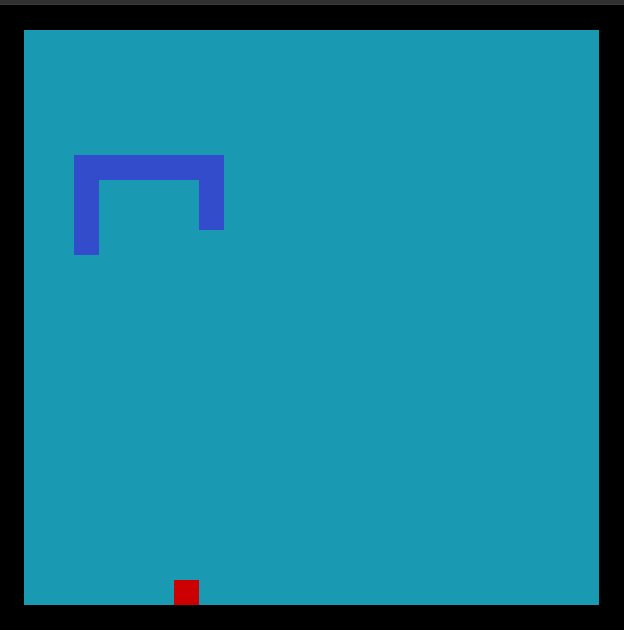

+++
title = 'rusty-snake'
publishedDate = 2025-02-31T10:09:21+07:00
draft = false
repo = 'https://github.com/nibtr/rusty-snake'
description = 'A simple snake game written in Rust'
+++

A snake game written in Rust for educational purposes to learn the
basics and idiomatic Rust code.



## Controls

- Arrow keys: move the snake

## Quick start

Make sure Rust is installed, then run

```bash
cargo run --release
```
