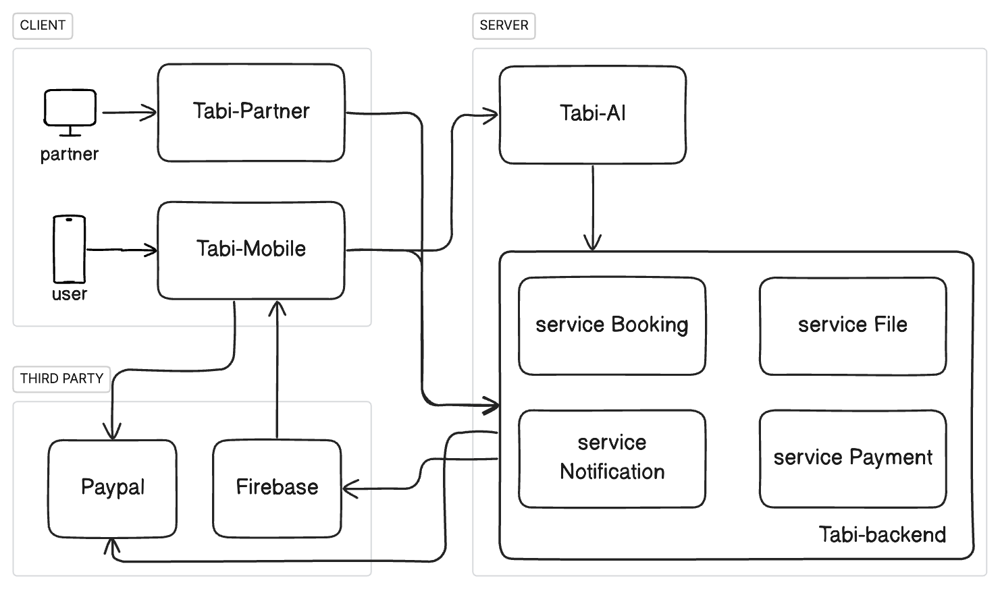
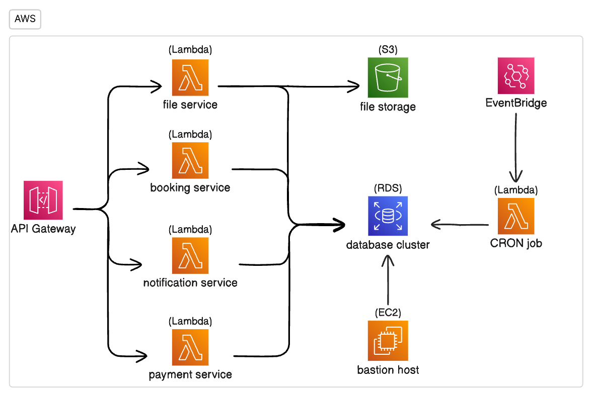

+++
title = 'Tabi'
publishedDate = 2025-10-31T10:09:21+07:00
draft = false
repo = 'https://github.com/nibtr/tabi-backend'
demo = 'https://tabi-partner.vercel.app'
description = 'A booking application with support for push notifications and a small recommendation engine'
+++

**Tabi** (旅: Japanese for "trip" ) is a booking application with support for push notifications and a small recommendation engine
to help users find the best trip plan for their destination. 

The application is built for the final year project at my university, and is composed of several backends and frontends.

## System overview

### Backends

The system is designed following a microservices architecture, each service is responsible for a specific functionality:

- [tabi-booking](https://github.com/nibtr/tabi-backend/tree/main/tabi-booking): The main server of our backend, contains
the logic for managing bookings.
- [tabi-file](https://github.com/nibtr/tabi-backend/tree/main/tabi-file): The service to connect to S3 for file storage.
- [tabi-notification](https://github.com/nibtr/tabi-backend/tree/main/tabi-notification): The service implementing a CRON
job for push notifications with Firebase.
- [tabi-payment](https://github.com/nibtr/tabi-backend/tree/main/tabi-payment): The service integrating Paypal sandbox
environment for executing transactions. 
- [tabi-ai](https://github.com/nibtr/tabi-ai): A service that provides APIs for planning trips, integrating a small recommendation system.

### Frontends

For web apps, we have 2 pages: partner and landing. We also have a mobile app for users.

- [tabi-partner](https://github.com/nibtr/tabi-partner): Main frontend of the application - web app for partners served
as a platform to manage bookings and revenue for their accommodation services.
- [tabi-landing](https://github.com/nibtr/tabi-landing): Landing page for the application.
- [tabi-mobile](https://github.com/nibtr/tabi-mobile): Mobile app for users.

### Diagrams

## Features

- Create, update, and cancel bookings in real-time.
- Receive push notifications for booking status changes and reminders.
- Pay securely via PayPal.
- AI-based trip planner that recommends destinations and itineraries.
- Partner dashboard with analytics and revenue tracking.

## Recommendation system

The recommendation engine uses LangChain + Python scripts to suggest destinations based on user preferences and previous booking history,
leveraging RAG (Retrieval Augmented Generation) to retrieve relevant information from a vector database.

For more details, please refer to the [README](https://github.com/nibtr/tabi-ai/blob/main/README.md) of the `tabi-ai` repository.

## Technologies

- Programming language: Golang, Python, Typescript.
- Framework: Serverless, Langchain, Flask, Antd, React.
- AWS services: Lambda, VPC, RDS, EC2, EventBridge.
- 3rd party APIs: Paypal Sanbox, Firebase.

## Local development

Details of each repository and instructions can be found in their respective README files.

## Contributions

The project is a collaborative effort between me and my teammates back in 2024. Thank you for your support!

- [Nam Vu Hoai](https://github.com/namhoai1109)
- [Trung Thieu](https://github.com/tvtrungg)
- [Tan Truong](https://www.linkedin.com/in/tantk296/)
